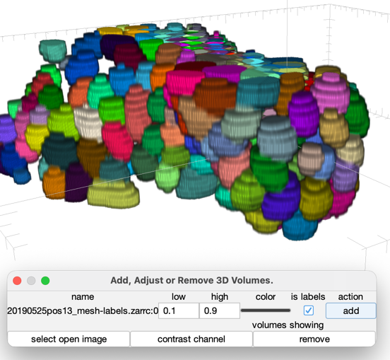
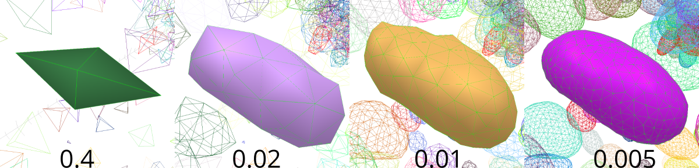

# Label to mesh conversions

A common task is working from labelled images. Essential a mask where each 
number corresponds to a different object. This guide will demonstrate how to 
work from a mask and generate meshes. How to automate the process.

## Preparing the image.

### Loading the image

Essentially load a 3D time series into fiji. **Often programs that generate masks
will not produce the correct metadata** It is important that the pixel dimensions are correct.

Starting dm3d, selecting the image. Use manage volumes and 


If the labels look like they have the wrong scale, check the image properties, then select the
the image again. You'll also have to remove the displayed volume for it to update.

### Setting the connection length.

The connection length will determine the number of triangles used in the mesh. The easiest way to 
check, is to use the menu item `mesh > Relax Mesh from  Labels`. If they don't look good update the
value and try again.



**If the value is too small, this can be very slow.** Another way to do this that has less chance of 
freezing for a long time: "initialize mesh", create a sphere roughly the size of the objects that
are labelled, then use the "connection remesh" button ('m' with the 3D window selected.)

## Scripting

### Built in javascript console

Using the menu item "tools > javascript console".

```javascript
folder = GuiTools.getDirectory( IJ.getInstance(), "select destination folder");
for(i = 0; i<10; i++){
    controls.toFrame(i);
    controls.meshesFromLabelledImage();
    op = new File(folder, "meshes-" + i + ".stl" );
    controls.exportAsStl(op);
}
```

### Build in script editor

The Fiji script editor can also be used. For example in either python or jython
the following will work.

```python
#@ Dm3dService service
controls = service.getApplicationController()
n = controls.getNFrames()
for i in range(n):
    controls.toFrame(i)
    controls.meshesFromLabelledImage();
```

I've omitted the stl saving part because the two different versions of python require slightly
different techniques to import the java classes.

For python mode you need to use scyjava.jimport
```python
#@ Dm3dService service

from scyjava import jimport

File = jimport("java.io.File")
GuiTools = jimport("deformablemesh.gui.GuiTools")
IJ = jimport("ij.IJ");
folder = GuiTools.getDirectory( IJ.getInstance(), "select destination folder")

controls = service.getApplicationController()

n = controls.getNFrames();

for i in range(n):
    controls.toFrame(i)
    controls.meshesFromLabelledImage()
    out = File( folder, "%03d.stl"%i )
    controls.exportAsStl(out)

```

## Advandced example, headless using pyimagej.

To run this headless using pyimagej, you need a python environment with pyimagej
and a fiji install with dm3d installed. Then the script can be run as

    python auto_mesh.py ./Fiji

Of course the ./Fiji needs to point to the fiji with DM3D. Also JAVA_HOME environment
variable needs to be set to 

```python
import imagej
import sys

ij = imagej.init(sys.argv[1], mode="headless")

from scyjava import jimport

File = jimport("java.io.File")


ctx = ij.context()
service = ctx.getService("deformablemesh.gimli2b.Dm3dService");

controls = service.createHeadlessController()
def check():
    print("check is working")
controls.submit(check)
print(controls)
def main():
    controls.loadImage("labels.tif")
    print("loaded image")
    n = controls.getNFrames()
    for i in range(n):
        controls.toFrame(i)
        controls.meshesFromLabelledImage()
        out = File( "meshes", "%03d.stl"%i )
        controls.exportAsStl(out)

controls.submit( main )
controls.shutdown()

```

DM3D manages all of it's state on a single thread. By using a main method
and submit everything will happen on that thread and race conditions can be
avoided.

In this example. `controls.loadImage("labels.tif")` loads the image on
the DM3D thread, so `n = controls.getNFrames()` happens before the image
gets loaded and n is 999. 

